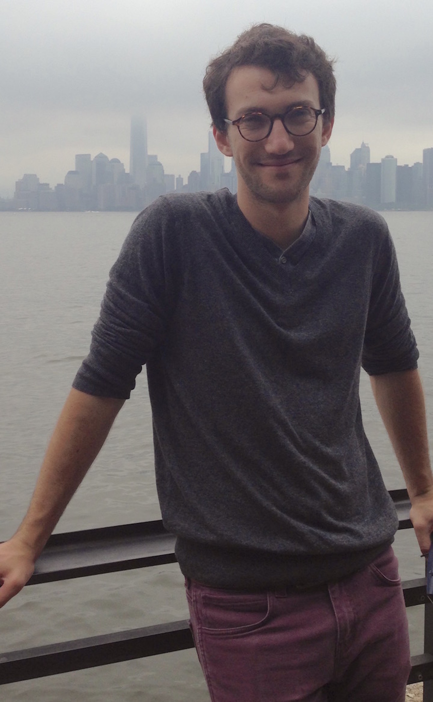

### PhD Student in Applied Mathematics, <a href="https://www.math.ucdavis.edu/">UC Davis</a>
 

# Contact

- Email: SamFleischer \_at\_ ucdavis \*dot\* edu
- Office: MSB 2141
- Office Hours: MSB 2141: TBD
<!-- - <a href="https://www.math.ucdavis.edu/resources/calc_room/">Calculus Room</a> Hours: Wednesdays 4-5p -->

# Research

- Currently working with <a href="http://www-eve.ucdavis.edu/sschreiber/">Sebastian Schreiber</a> on mathematical models of ecological systems and interactions
- Interested in:
    - Dynamical Systems
    - Differential Equations
    - Ecology
    - Evolution
    - Epidemiology

# Teaching Assistant

- MAT 021C, Fall Quarter 2015
    <!-- - Lecture: Mon, Wed, Fri 10a-10:50a, Scrub Oak Auditorium 160
    - Discussion: Tues 8:10p-9p, Bainer Hall 1060
    - <a href="https://smartsite.ucdavis.edu/portal/site/9bba5bd4-0ce1-49c1-bfaa-46d16aa1d5ca">Course webpage</a>
    - <a href="supporting_files/class_notes/Fall2015_MAT021C/notes.html">Notes from my discussion section</a> -->
- MAT 022AL, Winter Quarter 2016
    <!-- - Thurs 2:10p-3p, Mathematical Science Building 2118 -->
- MAT 017C, Spring Quarter 2016
    <!-- - Lecture: Mon, Wed, Fri 8a-8:50a, Giedt Hall 1001
    - Discussion: Thurs 6:10-7p, EPSCI 1317
    - <a href="https://smartsite.ucdavis.edu/portal/site/6be831d5-80a8-4bf8-bc4e-1c5a4c2ce2c3">Course webpage</a> -->
- MAT 017A, Fall Quarter 2016
    - Lecture: Monday, Wednesday, Friday 3:10-4p, Haring Hall 2205
    - Discussion: Section C04 Thursday 7:10-8p, Bainer Hall 1060
    - Discussion: Section C05 Thursday 8:10-9p, Bainer Hall 1132
    

# Resume

- Download my <a href="supporting_files/Fleischer_Resume.pdf">resume</a> and <a href="supporting_files/Fleischer_CV.pdf">curriculum vitae</a>
