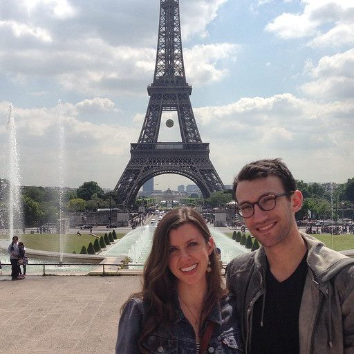

### PhD Student in Applied Mathematics, <a href="https://www.math.ucdavis.edu/">UC Davis</a>
 

# Contact

- Email: SamFleischer \_at\_ ucdavis \*dot\* edu
- Office: MSB 2232
- Office Hours: Thurs 9:30-10:30a
- Calculus Room Hours: Tues 6-7p

# Research

- Currently working with <a href="http://www-eve.ucdavis.edu/sschreiber/">Sebastian Schreiber</a> on mathematical models of ecological systems and interactions
- Interested in:
    - Dynamical Systems
    - Differential Equations (systems, ordinary, partial)
    - Numerical Analysis
    - Ecology and Evolution
    - Biology
    - Astronomy and Astrophysics

# Teaching

- MAT 021C, Fall Quarter 2015, 1060 Bainer, Tues 8:10p-9p, Link to <a href="https://smartsite.ucdavis.edu/portal/site/9bba5bd4-0ce1-49c1-bfaa-46d16aa1d5ca">course webpage</a>
    - <a href="supporting_files/class_notes/Fall2015_MAT021C/notes.html">Notes from my discussion section</a>

# Resume

- Download my <a href="supporting_files/Fleischer_Resume.pdf">resume</a>